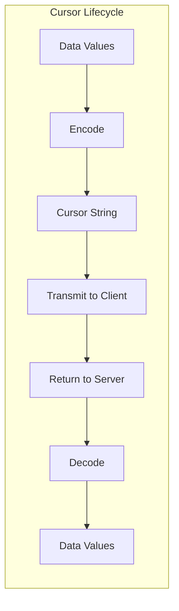
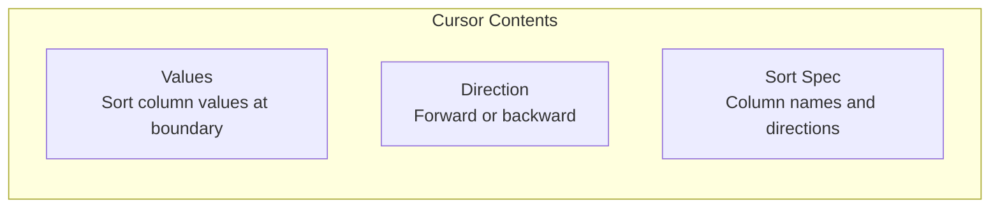
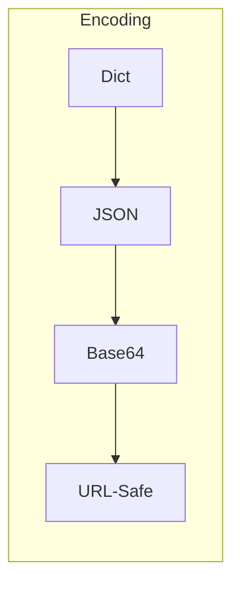
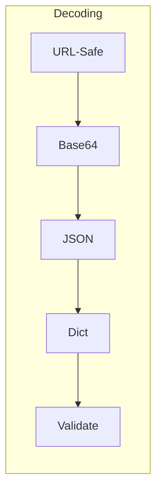
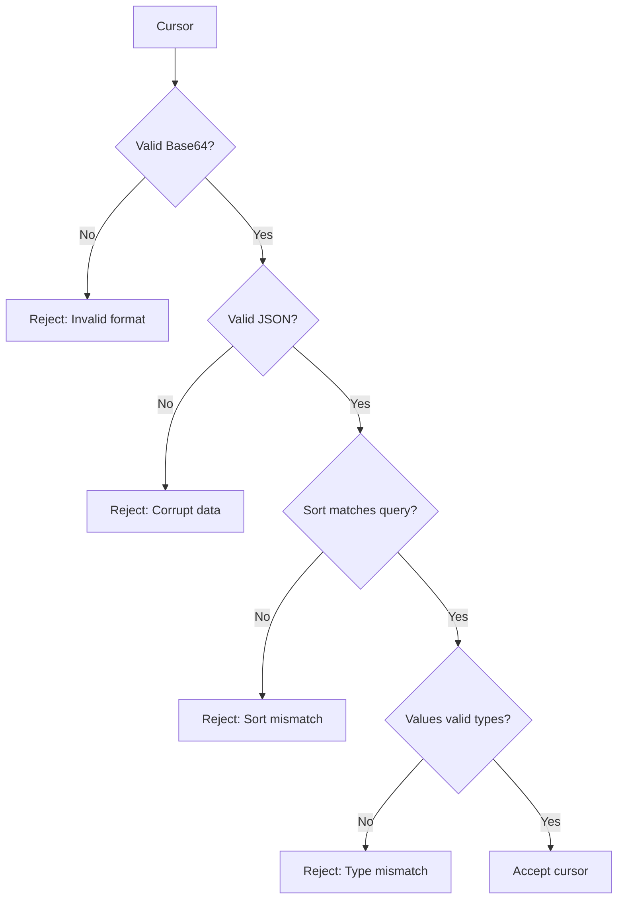
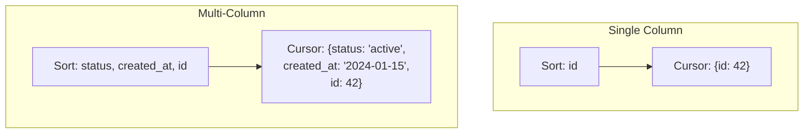
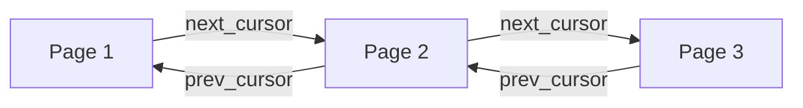
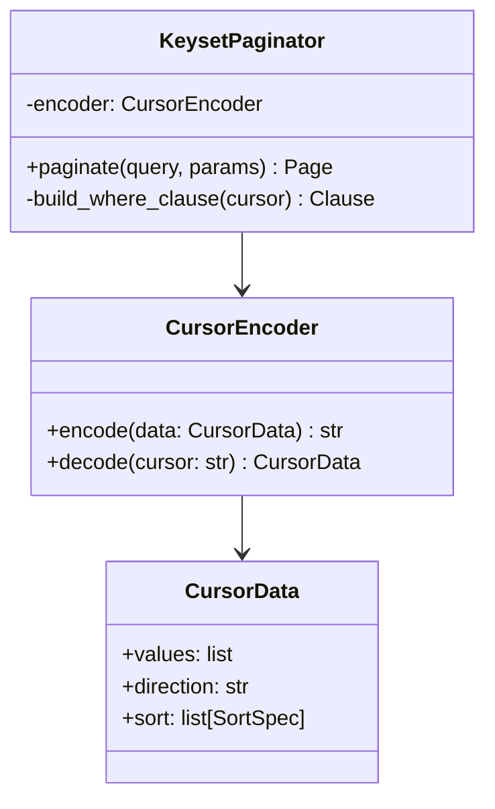

# Cursor Encoding

Cursors are opaque tokens that represent a position in a result set. Understanding how
they work helps you debug pagination issues and design efficient APIs.

## What is a Cursor?

A cursor is an encoded string that contains all the information needed to resume
pagination from a specific position. It's designed to be:

- **Opaque** - Clients shouldn't parse or construct cursors
- **Stateless** - The server doesn't need to store session data
- **Tamper-resistant** - Invalid cursors are rejected gracefully
- **Compact** - Efficient to transmit in URLs or JSON



## Cursor Structure

A cursor in pypaginate contains:



### Example Cursor

For a query sorted by `created_at DESC, id ASC`, the cursor after the last item might
contain:

```json
{
  "values": ["2024-01-15T10:30:00Z", 42],
  "direction": "forward",
  "sort": [
    {"column": "created_at", "desc": true},
    {"column": "id", "desc": false}
  ]
}
```

This gets encoded to something like:

```
eyJ2YWx1ZXMiOiBbIjIwMjQtMDEtMTVUMTA6MzA6MDBaIiwgNDJdLCAiZGlyZWN0aW9uIjog...
```

## Encoding Process



1. **Serialize** - Convert cursor data to JSON
2. **Encode** - Base64 encode the JSON
3. **URL-safe** - Replace `+` with `-` and `/` with `_`

### Why This Encoding?

| Step | Reason |
|------|--------|
| JSON | Universal, language-agnostic format |
| Base64 | Binary-safe, no special characters |
| URL-safe | Can be used in query parameters without escaping |

## Decoding Process



1. **URL-decode** - Restore Base64 characters
2. **Base64 decode** - Get JSON string
3. **Parse JSON** - Get cursor data
4. **Validate** - Ensure cursor matches current query

## Cursor Validation

Cursors are validated to prevent attacks and catch bugs:



### Common Validation Errors

| Error | Cause | Solution |
|-------|-------|----------|
| Invalid format | Corrupted or truncated cursor | Get fresh cursor from first page |
| Sort mismatch | Sort order changed between requests | Use consistent sort parameters |
| Type mismatch | Column type changed | Refresh cursor after schema changes |
| Expired cursor | Optional TTL exceeded | Paginate from beginning |

## Multi-Column Cursors

When sorting by multiple columns, the cursor contains values for all sort columns:



### Why All Columns?

The cursor must contain all sort columns to generate the correct WHERE clause:

```sql
-- Single column: Simple comparison
WHERE id > 42

-- Multi-column: Compound comparison
WHERE status > 'active'
   OR (status = 'active' AND created_at > '2024-01-15')
   OR (status = 'active' AND created_at = '2024-01-15' AND id > 42)
```

pypaginate handles this complexity automatically.

## Bidirectional Pagination

Cursors support both forward and backward navigation:



### Forward vs Backward

| Direction | Cursor | Comparison | Order |
|-----------|--------|------------|-------|
| Forward | `after` | `>` or `<` based on sort | Same as sort |
| Backward | `before` | Opposite of sort | Reversed, then flip results |

## Security Considerations

### What Cursors Expose

Cursors contain actual data values from your database:

```json
{
  "values": ["john@example.com", 12345]
}
```

!!! warning "Sensitive Data"
    If you sort by sensitive columns (email, name, etc.), those values
    will be visible in the cursor. Consider:
    
    - Sorting by non-sensitive columns (id, created_at)
    - Encrypting cursors for sensitive applications
    - Using opaque IDs instead of sensitive values

### Cursor Tampering

Users might try to modify cursors to:

- Access unauthorized data
- Skip pagination limits
- Cause errors

pypaginate validates cursors strictly, but sorting by user IDs or other
authorization-relevant columns requires additional checks.

## Best Practices

### Do

- ✅ Treat cursors as opaque strings
- ✅ Include a unique column in sort (tiebreaker)
- ✅ Use consistent sort order across requests
- ✅ Handle invalid cursors gracefully (return to page 1)
- ✅ Log cursor decode errors for debugging

### Don't

- ❌ Parse or construct cursors client-side
- ❌ Sort by sensitive columns if cursor exposure is a concern
- ❌ Cache pages by cursor (cursors may encode timestamps)
- ❌ Assume cursor format is stable across versions

## Debugging Cursors

pypaginate provides utilities to inspect cursors during development:

```python
from pypaginate.engines.keyset import decode_cursor

# Decode for debugging (don't use in production!)
cursor = "eyJ2YWx1ZXMiOiBbNDJdLCAic29ydCI6IFt7ImNvbHVtbiI..."
data = decode_cursor(cursor)
print(data)
# {'values': [42], 'sort': [{'column': 'id', 'desc': False}], ...}
```

!!! note
    Cursor internals may change between versions. Only use decode for debugging.

## Implementation Details

For those interested in the internals:



## Further Reading

- [Pagination Strategies](pagination-strategies.md) - When to use keyset pagination
- [User Guide: Keyset Pagination](../user-guide/pagination/keyset.md) - Practical usage
- [Architecture](architecture.md) - Overall library design
