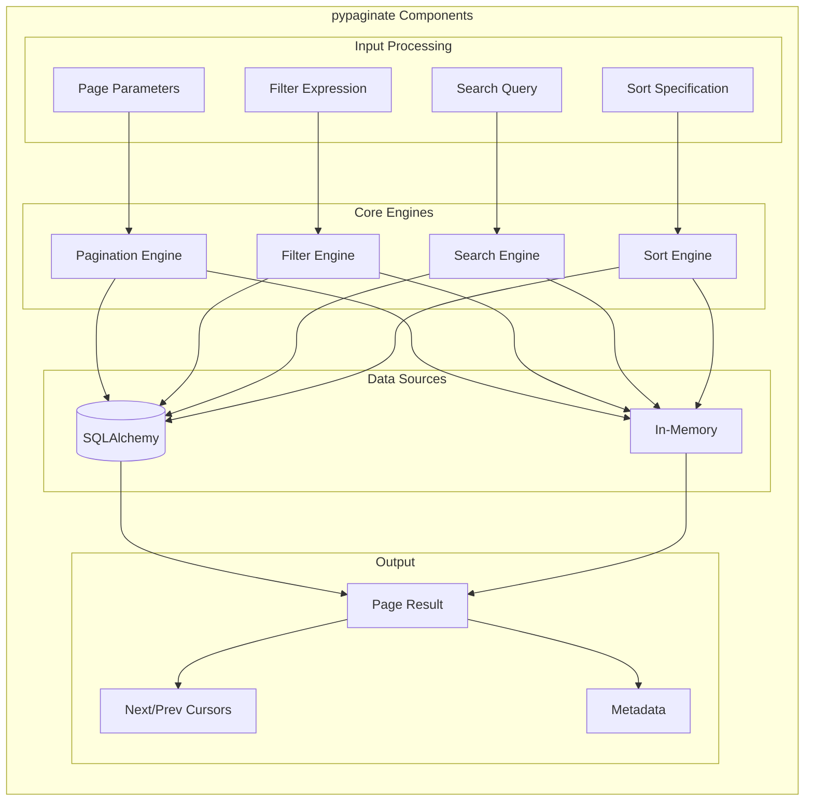

# Concepts

This section explains the core concepts behind pypaginate, helping you understand
how the library works and make informed decisions about which features to use.

## Why Read This?

While you can use pypaginate effectively by following the documentation,
understanding the underlying concepts will help you:

- **Choose the right pagination strategy** for your use case
- **Optimize performance** for large datasets
- **Debug issues** when things don't work as expected
- **Extend the library** for custom requirements

## Topics

-   :material-book-open-page-variant:{ .lg .middle } **Pagination Strategies**

    ---

    Understand offset vs keyset pagination, their trade-offs, and when to use each.

    [:octicons-arrow-right-24: Learn more](pagination-strategies.md)

-   :material-cursor-default:{ .lg .middle } **Cursor Encoding**

    ---

    How cursors work, what they contain, and how they enable stateless pagination.

    [:octicons-arrow-right-24: Learn more](cursor-encoding.md)

-   :material-filter:{ .lg .middle } **Filter Expressions**

    ---

    The filter engine architecture, operators, and how expressions are evaluated.

    [:octicons-arrow-right-24: Learn more](filter-expressions.md)

-   :material-magnify:{ .lg .middle } **Search & Relevance**

    ---

    How text search works, relevance scoring, and fuzzy matching algorithms.

    [:octicons-arrow-right-24: Learn more](search-relevance.md)

-   :material-sitemap:{ .lg .middle } **Architecture**

    ---

    Overall library design, component relationships, and extension points.

    [:octicons-arrow-right-24: Learn more](architecture.md)

## Quick Concept Overview

## Key Decisions

When using pypaginate, you'll need to make a few key decisions:

| Decision | Options | Recommendation |
|----------|---------|----------------|
| **Pagination Style** | Offset, Keyset | Use keyset for large datasets or infinite scroll |
| **Data Source** | SQLAlchemy, In-Memory | Use SQLAlchemy for database-backed apps |
| **Filter Format** | Dict predicates, JSONLogic | Use JSONLogic for complex client-defined filters |
| **Search Type** | Simple, Fuzzy | Use fuzzy for user-facing search with typo tolerance |
