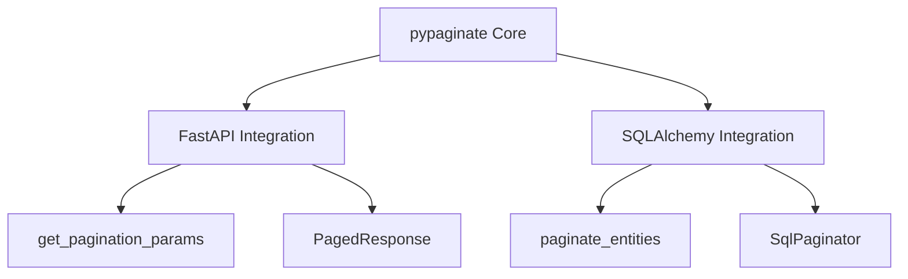

# Framework Integrations

pypaginate provides seamless integrations with popular Python frameworks and ORMs. These integrations simplify common patterns and provide framework-specific utilities.

## Available Integrations

| Integration | Description | Installation |
|------------|-------------|--------------|
| [FastAPI](fastapi.md) | Dependency injection, Pydantic models | `pip install pypaginate[fastapi]` |
| [SQLAlchemy](sqlalchemy.md) | Async pagination, query building | Included by default |

## Quick Overview

### FastAPI Integration

The FastAPI integration provides:

- **Dependency injection** for pagination parameters
- **Pydantic response models** for OpenAPI documentation
- **Query parameter parsing** with validation

```python
from fastapi import Depends, FastAPI
from pypaginate.integrations.fastapi import get_pagination_params, PagedResponse
from pypaginate.core import PageParams

app = FastAPI()

@app.get("/users", response_model=PagedResponse[UserSchema])
async def list_users(
    params: PageParams = Depends(get_pagination_params),
):
    # params.page, params.limit available
    ...
```

### SQLAlchemy Integration

The SQLAlchemy integration provides:

- **Async pagination** with SQLAlchemy 2.0+
- **Offset and keyset strategies** for different use cases
- **Automatic count queries** with optimization

```python
from sqlalchemy import select
from pypaginate.query import paginate_entities_to_page
from pypaginate.core import PageParams

async def get_users(session: AsyncSession) -> Page[User]:
    stmt = select(User).order_by(User.created_at.desc())
    params = PageParams(page=1, limit=20)
    
    return await paginate_entities_to_page(session, stmt, params)
```

## Installation

### All Integrations

```bash
pip install pypaginate[all]
```

### FastAPI Only

```bash
pip install pypaginate[fastapi]
```

### Base Package (SQLAlchemy included)

```bash
pip install pypaginate
```

## Architecture



## Next Steps

- [FastAPI Integration](fastapi.md) - Complete FastAPI setup guide
- [SQLAlchemy Integration](sqlalchemy.md) - Database pagination patterns
