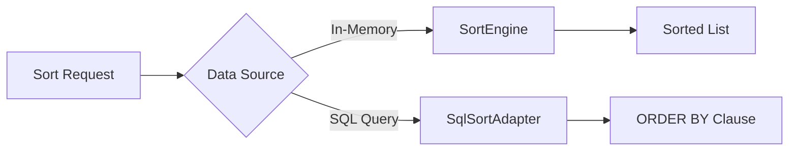

# Sorting

pypaginate provides flexible sorting capabilities for both in-memory collections and SQL queries. The sorting system supports:

- **Single-field sorting** with ascending/descending order
- **Multi-column sorting** for complex ordering requirements
- **Null value positioning** (first or last)
- **Deterministic tie-breaking** for stable sort results
- **SQL ORDER BY generation** via the SQL adapter

## Overview

The sorting module consists of two main components:

| Component | Use Case |
|-----------|----------|
| `SortEngine` | In-memory sorting of Python objects |
| `SqlSortAdapter` | Building SQLAlchemy ORDER BY clauses |

## Quick Example

### In-Memory Sorting

```python
from pypaginate.sorting import SortEngine, sort_items

# Define some data
users = [
    User(name="Alice", age=30),
    User(name="Bob", age=None),
    User(name="Charlie", age=25),
]

# Sort by age with nulls last
sorted_users = sort_items(
    users,
    sort_field="age",
    reverse=False,
    nulls_position="last",
    tie_breaker_field="name",
)
# Result: [Charlie(25), Alice(30), Bob(None)]
```

### SQL Sorting

```python
from sqlalchemy import select
from pypaginate.sorting import SqlSortAdapter

# Build ORDER BY expression
order_expr = SqlSortAdapter.build_order_expression(
    column=User.created_at,
    descending=True,
    nulls_position="last",
)

# Apply to query
stmt = select(User).order_by(order_expr)
```

## Key Features

### Null Handling

pypaginate gives you explicit control over where `None` values appear:

```python
# Nulls first (default for many databases with ASC)
sorted_items(items, "field", nulls_position="first", ...)

# Nulls last (often preferred for descending sorts)
sorted_items(items, "field", nulls_position="last", ...)
```

### Tie-Breaking

For deterministic results, specify a secondary sort field:

```python
sorted_users = sort_items(
    users,
    sort_field="department",
    reverse=False,
    nulls_position="last",
    tie_breaker_field="id",  # Ensures stable ordering
)
```

### Type-Safe Sorting

The sorting engine handles heterogeneous types gracefully:

- Numbers are sorted numerically
- Strings are sorted lexicographically
- Mixed types are grouped by type, then sorted within groups

## Architecture



## Next Steps

- [Basic Sorting](basic.md) - Learn single-field sorting
- [Multi-Column Sorting](multi-column.md) - Complex ordering scenarios
