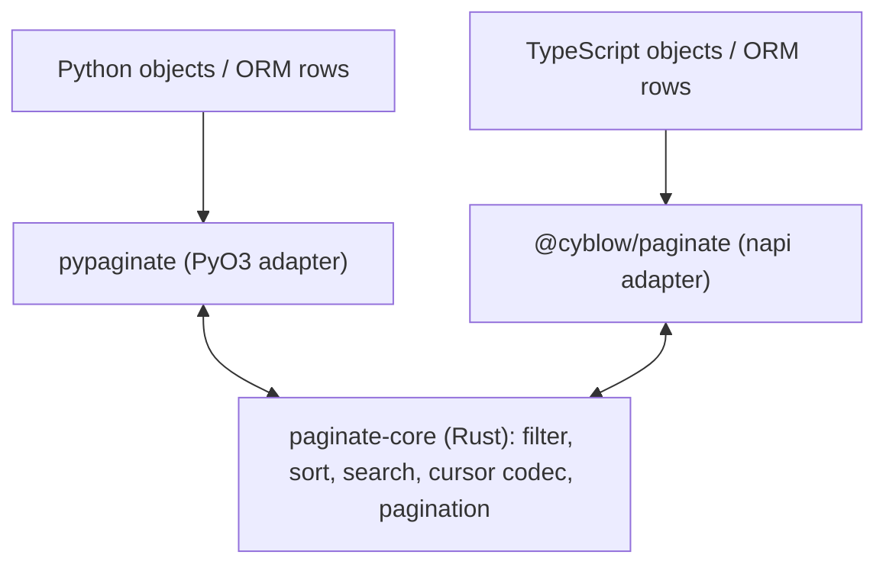
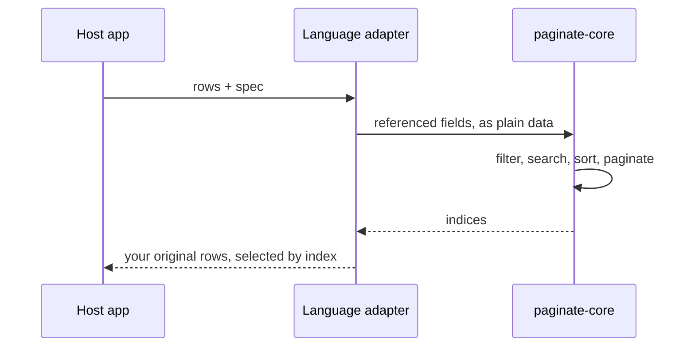

# Architecture — fat core, thin adapters

All computation lives **once** in the Rust core (`paginate-core`): filtering (20
operators + nested And/Or groups), stable multi-key sorting with null placement,
ranked + fuzzy (trigram) search, the cursor codec, the keyset predicate, and
pagination math.

The language packages are **thin adapters**:

- they marshal your objects / ORM rows into the plain data the core understands;
- the core returns **indices**, and the adapter selects your original objects — rows
  are never copied or validated through the binding (zero per-row cost);
- validation rules, wire tokens, and limits live in the core too, so the packages
  delegate rather than re-implement.

The boundary is **native** by design: Python via [PyO3](https://pyo3.rs) +
[maturin](https://www.maturin.rs), Node/TypeScript via [napi-rs](https://napi.rs).
The core carries **zero binding dependencies**, so the exact same crate links into
both — and compiles unchanged to WebAssembly for an optional browser/edge target.

## The `Value` boundary

The core speaks only **plain data** — a small JSON-like `Value` model
(`Null | Bool | Int | Float | Str | List | Map`, plus typed scalars like
`DateTime` / `Date` / `Decimal` / `Uuid` that carry their canonical string so
cursors round-trip with full fidelity). No host objects, no ORM models, and no
framework types ever cross the boundary; the adapter converts host objects to/from
`Value`. See the [Rust core design](../rust/design) for the full model.

## Generated types

The type **shapes** (filter / sort / search specs, params, page metadata, enums) are
generated from a single JSON Schema emitted by the core. The Python package renders
them as dataclasses and the TypeScript package as interfaces, so the two can't drift
and both match the Rust source. Operators, directions, and modes are plain strings
(`"gte"`, `"desc"`, `"contains"`) — also defined once in the core.

## Marshalling: build once, query many

Crossing the FFI boundary has a cost, and the engine's design respects it:

- **Small-payload work is a native win.** The cursor codec and pagination math move a
  handful of scalars, so the boundary cost is negligible and the Rust implementation
  is the obvious home.
- **Large-payload work returns indices, not rows.** `filter`, `sort`, and `search`
  return a list of **indices**; the adapter selects from your original objects, so an
  ORM model never round-trips through Rust as data.

- **The resident [`Dataset`](../python/pagination#the-resident-dataset) is the big win.** One-shot
  calls re-marshal the whole collection every time. A `Dataset` marshals the rows into
  the core **once**, then answers many filter / sort / search / page queries
  natively — and a typed **columnar** fast path makes the fused
  filter → sort → paginate pipeline dramatically faster than the host. Use it for a
  stable in-memory dataset served by many paginated requests.

The honest, measured trade-offs (including where naive host array operations win) are
documented in [Rust core → performance](../rust/performance).

## Adapters

In-memory pagination needs no adapter — the core *is* the engine, reached through the
top-level `paginate` / `filter` / `sort` / `search` and `Dataset`. Adapters exist only
to bridge systems the core can't see:

- **Python** — [SQLAlchemy](../python/integrations/sqlalchemy),
  [Django](../python/integrations/django), [FastAPI](../python/integrations/fastapi).
- **TypeScript** — [Express](../typescript/integrations/express),
  [Prisma](../typescript/integrations/prisma), [Drizzle](../typescript/integrations/drizzle).

Each adapter owns its ORM / framework concern and hands the core nothing but plain
data — the strict ports-and-adapters boundary that keeps the engine decoupled from
any one runtime.
