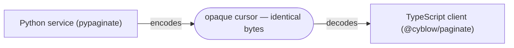

# Cross-language parity

Because the engine has a single implementation, the Python and TypeScript packages
return **identical results** — the same filtered / sorted / ranked order — and
**byte-identical cursors**.

A cursor minted in either language decodes byte-for-byte in the other — the same is
true for filter, sort, and search results.

A frozen golden fixture (`tests/fixtures/parity.json`) is asserted by all three
languages in CI: the Rust core, `pypaginate`, and `@cyblow/paginate` must each
reproduce it exactly. It covers:

- all 20 filter operators (incl. `in` / `not_in`, `between`, `is_null`, `regex`,
  `empty` / `not_empty`, `exists`) and AND/OR logic,
- sort direction with null placement (`first` / `last`),
- search modes (`contains` / `prefix` / `exact`),
- the cursor codec, including typed values (datetime, date, decimal, uuid).

The practical payoff: a cursor minted by a Python service decodes byte-for-byte in a
TypeScript client, and a filter expression behaves the same everywhere.

## Why it holds

Parity isn't a promise to keep two implementations in sync — there *is* only one. The
packages are [thin adapters](./architecture): they marshal your data in, call the core,
and select results by the indices it returns. The operators, the sort comparator, the
search ranker, the cursor format, and the validation rules all live in the core, so
there is nothing to drift.

The type shapes are generated from a single JSON Schema the core emits, so even the
**spec / param / page field names** are guaranteed to match (modulo `snake_case` vs
`camelCase` naming style).

## What "identical" means precisely

- **Same order.** Given the same rows and the same spec, the sequence of results is
  identical — including stable tie-breaking and null placement.
- **Same cursor bytes.** `encodeCursor([...])` in TypeScript and the Python codec
  produce the same string for the same ordering values, so cursors are portable in
  both directions.
- **Same errors.** An unknown operator, an unorderable comparison, or an out-of-range
  limit fails in every language — each mapped to that language's exception type with a
  matching hierarchy.

## What is *not* guaranteed to match

- **Raw timing.** The packages have different host runtimes; see
  [performance](../rust/performance).
- **Naming style.** Python `has_next` ↔ TypeScript `hasNext`.
- **Floating-point display**, language-native repr, and similar host-level cosmetics.
