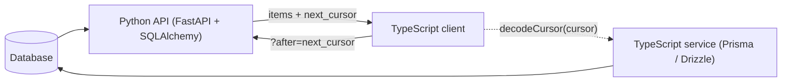

# Sharing cursors across Python & TypeScript

This is the feature that sets paginate apart: a keyset cursor minted by a **Python**
service decodes **byte-for-byte** in **TypeScript**, because both call the same Rust
codec. Here's the whole loop.



## 1. The Python service mints cursors

A FastAPI endpoint backed by the SQLAlchemy cursor adapter. `CursorDep` parses
`?limit=&after=&before=`, and the backend returns a `CursorPage` with the navigation
cursors.

```python
from typing import Annotated
from fastapi import Depends, FastAPI
from pydantic import BaseModel
from sqlalchemy import select
from sqlalchemy.ext.asyncio import AsyncSession
from pypaginate.adapters.fastapi import CursorDep
from pypaginate.adapters.sqlalchemy import SQLAlchemyCursorBackend

app = FastAPI()

class PostOut(BaseModel):
    id: int
    title: str
    model_config = {"from_attributes": True}

@app.get("/posts")
async def list_posts(
    params: CursorDep,
    session: Annotated[AsyncSession, Depends(get_session)],
):
    # A unique ORDER BY is required — append the primary key as a tiebreaker.
    stmt = select(Post).order_by(Post.created_at.desc(), Post.id.desc())
    page = await SQLAlchemyCursorBackend(session).fetch_page(stmt, params)
    return {
        "items": [PostOut.model_validate(p) for p in page],
        "next_cursor": page.next_cursor,
        "previous_cursor": page.previous_cursor,
        "has_next": page.has_next,
    }
```

A response looks like:

```json
{
  "items": [{ "id": 120, "title": "…" }, "… 19 more"],
  "next_cursor": "W3siX190eXBlX18iOiJkYXRldGltZSIsInYiOiIyMDI1LTA2LTAxVDAwOjAwOjAwIn0sMTAwXQ",
  "previous_cursor": null,
  "has_next": true
}
```

## 2. The TypeScript client follows the cursor

The client doesn't need to understand the cursor at all — it just echoes
`next_cursor` back as `?after=` to page forward:

```ts
async function loadAllPosts(): Promise<Post[]> {
  const all: Post[] = [];
  let after: string | null = null;

  do {
    const qs = new URLSearchParams({ limit: "20", ...(after ? { after } : {}) });
    const res = await fetch(`https://api.example.com/posts?${qs}`);
    const page = await res.json();
    all.push(...page.items);
    after = page.next_cursor; // opaque — pass it straight back
  } while (after);

  return all;
}
```

## 3. …and a TypeScript service can *decode* the same cursor

Because the codec is shared, a TypeScript service can read the **Python-minted**
cursor and run its own keyset query — the decoded values are exactly what Python
encoded:

```ts
import { decodeCursor } from "@cyblow/paginate";

// `after` is the cursor string from the Python service:
decodeCursor(after);
// → ["2025-06-01T00:00:00", 100]   (the ORDER BY values: created_at, id)
```

Feed those decoded values into the [Prisma](../typescript/integrations/prisma#keyset-cursor-pagination)
or [Drizzle](../typescript/integrations/drizzle#keyset-cursor-pagination) keyset helper
to fetch the next page from a TypeScript-owned database — the boundary row is the same
one Python computed.

:::tip Typed values
Temporal scalars round-trip as their ISO string (`"2025-06-01T00:00:00"`). When you
hand them to an ORM that expects a native type, coerce first — e.g.
`new Date(values[0])` for a Prisma `DateTime` column.
:::

## Why it works

There is only one cursor codec, in the Rust core — see [cursors](../general/cursors) and
[cross-language parity](../general/parity). The format is deterministic and typed, so
switching a service's implementation language never invalidates a client's existing
cursors.

## Next

- [Pagination models](../general/pagination-models) — when to choose keyset.
- [Building a paginated API](./paginated-api) — offset, filtering, and sorting from query params.
